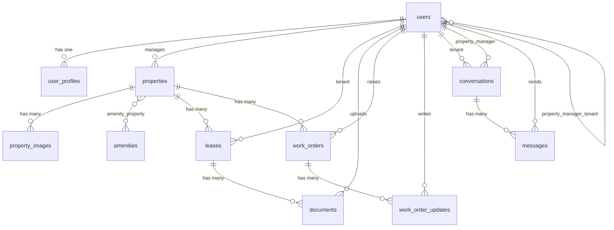

# Rently — Database Schema Documentation

> **Living document** — update this file as the project evolves.  
> Last updated: May 2026

---

## Table of Contents

1. [Overview](#overview)
2. [User Types](#user-types)
3. [ERD Diagram](#erd-diagram)
4. [Tables](#tables)
   - [users](#users)
   - [user_profiles](#user_profiles)
   - [roles (Spatie)](#roles-spatie)
   - [properties](#properties)
   - [property_images](#property_images)
   - [amenities](#amenities)
   - [amenity_property](#amenity_property)
   - [property_manager_tenant](#property_manager_tenant)
   - [leases](#leases)
   - [documents](#documents)
   - [work_orders](#work_orders)
   - [work_order_updates](#work_order_updates)
   - [conversations](#conversations)
   - [messages](#messages)
   - [notifications](#notifications)
   - [payments](#payments)
5. [Key Design Decisions](#key-design-decisions)
6. [Eloquent Models & Relationships](#eloquent-models--relationships)
7. [Route & Middleware Structure](#route--middleware-structure)
8. [Controllers](#controllers)
9. [Policies](#policies)
10. [Notifications](#notifications)
11. [View Structure](#view-structure)
12. [Feature Progress](#feature-progress)

---

## Overview

Rently is a housing rental portal built in Laravel. It supports three user types — Tenant, Property Manager, and Administrator — each with their own dashboard and permissions.

**Tech stack**
- Laravel 13 + Breeze (auth scaffolding)
- Spatie Laravel Permission (roles)
- MySQL

---

## User Types

| Role | Description |
|------|-------------|
| `admin` | Full system access. Manages users, properties, and assignments. |
| `property_manager` | Manages their assigned properties and tenants. |
| `tenant` | Access to their own lease, documents, messages, and work orders. |

---

## ERD Diagram



---

## Tables

---

### users

> Scaffolded by Laravel Breeze. Extended with `first_name` and `last_name`.

| Column | Type | Notes |
|--------|------|-------|
| `id` | bigint, PK | |
| `first_name` | string | |
| `last_name` | string | |
| `email` | string, unique | |
| `email_verified_at` | timestamp, nullable | |
| `password` | string | Hashed |
| `remember_token` | string, nullable | |
| `created_at` | timestamp | |
| `updated_at` | timestamp | |

---

### user_profiles

> Extended profile data for all user types. Kept separate from `users` to keep the auth table lean.

| Column | Type | Notes |
|--------|------|-------|
| `id` | bigint, PK | |
| `user_id` | FK → users | Cascades on delete |
| `legal_name` | string | |
| `preferred_name` | string, nullable | |
| `phone` | string, nullable | |
| `address` | string, nullable | Personal home address |
| `emergency_contact_name` | string, nullable | |
| `emergency_contact_phone` | string, nullable | |
| `emergency_contact_relationship` | string, nullable | e.g. spouse, parent, friend |
| `profile_image` | text, nullable | Storage path or URL |
| `created_at` | timestamp | |
| `updated_at` | timestamp | |

---

### roles (Spatie)

> Managed by [Spatie Laravel Permission](https://spatie.be/docs/laravel-permission). Do not modify manually.

**Seeded roles:**

| Name |
|------|
| `admin` |
| `property_manager` |
| `tenant` |

**Related Spatie tables:** `permissions`, `model_has_roles`, `model_has_permissions`, `role_has_permissions`

---

### properties

> A property belongs to a property manager. Can be assigned to a tenant via a lease.

| Column | Type | Notes |
|--------|------|-------|
| `id` | bigint, PK | |
| `property_manager_id` | FK → users, nullable | Cascades on delete |
| `title` | string | |
| `slug` | string, unique | SEO-friendly URL identifier |
| `key_features` | text, nullable | Free text / WYSIWYG input |
| `description` | longtext | |
| `address` | string | |
| `latitude` | decimal(10,7), nullable | |
| `longitude` | decimal(10,7), nullable | |
| `price` | decimal(10,2) | Monthly rent |
| `property_type` | enum | `house`, `apartment`, `studio`, `commercial` |
| `bedrooms` | tinyint unsigned | |
| `bathrooms` | tinyint unsigned | |
| `size` | integer, nullable | Square footage/metres — unit defined at app level |
| `availability_status` | enum | `available`, `occupied`, `under_maintenance` |
| `created_at` | timestamp | |
| `updated_at` | timestamp | |

---

### property_images

> Stores images for a property. Supports featured image and ordering.

| Column | Type | Notes |
|--------|------|-------|
| `id` | bigint, PK | |
| `property_id` | FK → properties | Cascades on delete |
| `path` | text | Storage path or URL |
| `is_featured` | boolean | Default: false |
| `sort_order` | integer | Default: 0 |
| `created_at` | timestamp | |
| `updated_at` | timestamp | |

---

### amenities

> A seeded lookup table of available amenities.

| Column | Type | Notes |
|--------|------|-------|
| `id` | bigint, PK | |
| `name` | string | e.g. Parking, Garden |
| `slug` | string, unique | |
| `created_at` | timestamp | |
| `updated_at` | timestamp | |

---

### amenity_property

> Pivot table — many-to-many between properties and amenities.

| Column | Type | Notes |
|--------|------|-------|
| `property_id` | FK → properties | Cascades on delete |
| `amenity_id` | FK → amenities | Cascades on delete |

Composite primary key: `(property_id, amenity_id)`

---

### property_manager_tenant

> Pivot table — links a property manager to their assigned tenants. Managed by admin. Independent of leases so the assignment can exist before a lease is created.

| Column | Type | Notes |
|--------|------|-------|
| `property_manager_id` | FK → users | Cascades on delete |
| `tenant_id` | FK → users | Cascades on delete |
| `created_at` | timestamp | |
| `updated_at` | timestamp | |

Composite primary key: `(property_manager_id, tenant_id)`

---

### leases

> Links a tenant to a property for a defined period. Core record for tenancy management.

| Column | Type | Notes |
|--------|------|-------|
| `id` | bigint, PK | |
| `property_id` | FK → properties | Restrict on delete — preserves lease history |
| `tenant_id` | FK → users | |
| `status` | enum | `pending`, `active`, `ended`, `terminated` |
| `rent_amount` | decimal(10,2) | |
| `start_date` | date | |
| `end_date` | date, nullable | |
| `terminated_at` | timestamp, nullable | |
| `termination_notes` | text, nullable | |
| `created_at` | timestamp | |
| `updated_at` | timestamp | |

---

### documents

> Documents uploaded by a property manager for a tenant. Can optionally be tied to a lease. Supports simple signature flow.

| Column | Type | Notes |
|--------|------|-------|
| `id` | bigint, PK | |
| `uploaded_by` | FK → users | Cascades on delete |
| `tenant_id` | FK → users | Cascades on delete |
| `lease_id` | FK → leases, nullable | Null on delete — important docs linked to lease |
| `property_id` | FK → properties, nullable | Context anchor when no lease exists |
| `title` | string | |
| `path` | text | Storage path or URL |
| `document_type` | string | e.g. tenancy_agreement, epc, welcome_pack. Consider enum once types are finalised |
| `requires_signature` | boolean | Default: false |
| `is_signed` | boolean | Default: false |
| `signed_at` | timestamp, nullable | |
| `created_at` | timestamp | |
| `updated_at` | timestamp | |

> **Validation note:** At least one of `lease_id` or `property_id` should be present. Enforce at app/validation layer.

---

### work_orders

> Maintenance/repair requests. Can be raised by either a tenant or property manager.

| Column | Type | Notes |
|--------|------|-------|
| `id` | bigint, PK | |
| `property_id` | FK → properties | Restrict on delete — preserve history |
| `lease_id` | FK → leases, nullable | Null on delete |
| `raised_by` | FK → users | Cascades on delete |
| `assigned_to` | FK → users, nullable | Null on delete — property manager or contractor |
| `title` | string | |
| `description` | text | |
| `priority` | enum | `low`, `medium`, `high`, `urgent` |
| `status` | enum | `open`, `in_progress`, `pending_review`, `resolved`, `closed` |
| `resolved_at` | timestamp, nullable | |
| `created_at` | timestamp | |
| `updated_at` | timestamp | |

---

### work_order_updates

> Log of comments and updates on a work order. Each entry tracks who posted it.

| Column | Type | Notes |
|--------|------|-------|
| `id` | bigint, PK | |
| `work_order_id` | FK → work_orders | Cascades on delete |
| `user_id` | FK → users | Cascades on delete |
| `comment` | text | |
| `created_at` | timestamp | |
| `updated_at` | timestamp | |

---

### conversations

> One conversation thread per tenant/property manager relationship. Not tied to a specific property or lease.

| Column | Type | Notes |
|--------|------|-------|
| `id` | bigint, PK | |
| `tenant_id` | FK → users | Cascades on delete |
| `property_manager_id` | FK → users | Cascades on delete |
| `last_message_at` | timestamp, nullable | Used to sort inboxes by recent activity |
| `created_at` | timestamp | |
| `updated_at` | timestamp | |

---

### messages

> Individual messages within a conversation. Supports system-generated messages.

| Column | Type | Notes |
|--------|------|-------|
| `id` | bigint, PK | |
| `conversation_id` | FK → conversations | Cascades on delete |
| `sender_id` | FK → users | Cascades on delete |
| `body` | text | |
| `is_system_message` | boolean | Default: false. System messages cannot be replied to |
| `read_at` | timestamp, nullable | Null = unread |
| `created_at` | timestamp | |
| `updated_at` | timestamp | |

---

### notifications

> Managed by Laravel's built-in notification system. Generated via:
> ```bash
> php artisan notifications:table
> ```

| Column | Type | Notes |
|--------|------|-------|
| `id` | uuid, PK | |
| `type` | string | Notification class name |
| `notifiable_type` | string | Polymorphic — typically `App\Models\User` |
| `notifiable_id` | bigint | |
| `data` | text | JSON payload |
| `read_at` | timestamp, nullable | |
| `created_at` | timestamp | |
| `updated_at` | timestamp | |

---

### payments

> ⏳ **Deferred** — to be designed once core functionality is complete.

Planned links: `lease_id`, `tenant_id`, payment gateway reference, amount, status, due date.

---

## Key Design Decisions

| Decision | Reason |
|----------|--------|
| Single `users` table for all roles | Simpler auth flow. Roles managed by Spatie. |
| `property_manager_tenant` pivot independent of leases | Admin can assign a tenant to a manager before a lease exists. |
| `restrictOnDelete` on `property_id` in leases | Prevents accidental deletion of a property with active/historical leases. |
| `tenant_id` uses `constrained('users')` explicitly | Laravel cannot infer the `users` table from a non-standard column name. |
| `last_message_at` on conversations | Avoids expensive subqueries when sorting inboxes. |
| `is_system_message` on messages | Allows UI to style and disable replies on automated messages (e.g. work order updates). |
| `read_at` timestamp instead of boolean | Gives read time for free, not just read state. |
| `document_type` as string (not enum yet) | Types not fully defined yet — convert to enum once finalised. |
| Laravel built-in notifications table | Integrates with `Notifiable` trait, supports multiple channels out of the box. |
| Spatie Laravel Permission for roles | Battle-tested, widely supported, clean API (`assignRole`, `hasRole`). |

---

## Eloquent Models & Relationships

### Overview

Each model maps to a database table and defines its relationships to other models. Laravel infers the table name from the class name automatically (e.g. `WorkOrder` → `work_orders`).

Where a foreign key uses a non-standard column name (e.g. `tenant_id`, `raised_by`), the table is passed explicitly to `belongsTo()` to avoid Laravel guessing incorrectly.

---

### User
**File:** `app/Models/User.php`

| Relationship | Type | Notes |
|---|---|---|
| `properties()` | hasMany Property | As property manager |
| `leases()` | hasMany Lease | As tenant |
| `profile()` | hasOne UserProfile | |
| `tenants()` | belongsToMany User | Via `property_manager_tenant` pivot |
| `propertyManager()` | belongsToMany User | Via `property_manager_tenant` pivot |

```php
// Usage examples
$user->properties;        // all properties managed by this user
$user->leases;            // all leases for this tenant
$user->profile;           // user's profile
$user->tenants;           // tenants assigned to this manager
$user->propertyManager;   // manager assigned to this tenant
```

---

### UserProfile
**File:** `app/Models/UserProfile.php`

| Relationship | Type | Notes |
|---|---|---|
| `user()` | belongsTo User | |

---

### Property
**File:** `app/Models/Property.php`

| Relationship | Type | Notes |
|---|---|---|
| `propertyManager()` | belongsTo User | Via `property_manager_id` |
| `images()` | hasMany PropertyImage | |
| `leases()` | hasMany Lease | |
| `workOrders()` | hasMany WorkOrder | |
| `amenities()` | belongsToMany Amenity | Via `amenity_property` pivot |

```php
// Usage examples
$property->propertyManager;  // the manager who owns this property
$property->images;           // all images for this property
$property->amenities;        // all amenities attached to this property
$property->leases;           // all leases for this property
```

---

### PropertyImage
**File:** `app/Models/PropertyImage.php`

| Relationship | Type | Notes |
|---|---|---|
| `property()` | belongsTo Property | |

---

### Amenity
**File:** `app/Models/Amenity.php`

| Relationship | Type | Notes |
|---|---|---|
| `properties()` | belongsToMany Property | Via `amenity_property` pivot |

```php
// Usage example
$amenity->properties;  // all properties with this amenity
```

---

### Lease
**File:** `app/Models/Lease.php`

| Relationship | Type | Notes |
|---|---|---|
| `property()` | belongsTo Property | |
| `tenant()` | belongsTo User | Via `tenant_id` |
| `documents()` | hasMany Document | |
| `workOrders()` | hasMany WorkOrder | |

```php
// Usage examples
$lease->tenant;     // the tenant on this lease
$lease->property;   // the property this lease is for
$lease->documents;  // all documents linked to this lease
```

---

### Document
**File:** `app/Models/Document.php`

| Relationship | Type | Notes |
|---|---|---|
| `uploadedBy()` | belongsTo User | Via `uploaded_by` |
| `tenant()` | belongsTo User | Via `tenant_id` |
| `lease()` | belongsTo Lease | Nullable |
| `property()` | belongsTo Property | Nullable |

---

### WorkOrder
**File:** `app/Models/WorkOrder.php`

| Relationship | Type | Notes |
|---|---|---|
| `property()` | belongsTo Property | |
| `lease()` | belongsTo Lease | Nullable |
| `raisedBy()` | belongsTo User | Via `raised_by` |
| `assignedTo()` | belongsTo User | Via `assigned_to`, nullable |
| `updates()` | hasMany WorkOrderUpdate | |

```php
// Usage examples
$workOrder->raisedBy;   // user who raised the work order
$workOrder->assignedTo; // user assigned to action it
$workOrder->updates;    // all updates/comments on this work order
```

---

### WorkOrderUpdate
**File:** `app/Models/WorkOrderUpdate.php`

| Relationship | Type | Notes |
|---|---|---|
| `workOrder()` | belongsTo WorkOrder | |
| `user()` | belongsTo User | |

---

### Conversation
**File:** `app/Models/Conversation.php`

| Relationship | Type | Notes |
|---|---|---|
| `tenant()` | belongsTo User | Via `tenant_id` |
| `propertyManager()` | belongsTo User | Via `property_manager_id` |
| `messages()` | hasMany Message | |
| `latestMessage()` | hasMany Message | Ordered by latest, limit 1. Used for inbox previews. |

```php
// Usage examples
$conversation->messages;       // all messages in this conversation
$conversation->latestMessage;  // most recent message for inbox preview
```

---

### Message
**File:** `app/Models/Message.php`

| Relationship | Type | Notes |
|---|---|---|
| `conversation()` | belongsTo Conversation | |
| `sender()` | belongsTo User | Via `sender_id` |

---

## Route & Middleware Structure

### Authentication
Handled by **Laravel Breeze**. Routes defined in `routes/auth.php`.

After login, users are redirected to their role-specific dashboard via the `AuthenticatedSessionController`.

### Role-based Redirects

| Role | Redirect |
|------|---------|
| `admin` | `/admin/dashboard` |
| `property_manager` | `/manager/dashboard` |
| `tenant` | `/tenant/dashboard` |

### Route Groups

Routes are grouped by role using Spatie's `role` middleware:

| Middleware | Prefix | Route Name Prefix |
|---|---|---|
| `auth, role:tenant` | `/tenant` | `tenant.` |
| `auth, role:property_manager` | `/manager` | `manager.` |
| `auth, role:admin` | `/admin` | `admin.` |

### Naming Convention

Routes follow Laravel's named route convention:

```php
// Examples
route('tenant.dashboard')   // → /tenant/dashboard
route('manager.dashboard')  // → /manager/dashboard
route('admin.dashboard')    // → /admin/dashboard
```

### Dashboard Views

| Role | View Path |
|------|----------|
| Tenant | `resources/views/dashboard/tenant/dashboard.blade.php` |
| Property Manager | `resources/views/dashboard/manager/dashboard.blade.php` |
| Admin | `resources/views/dashboard/admin/dashboard.blade.php` |

---

## Controllers

Controllers are organised by role namespace to keep concerns separated.

### Public
| Controller | Path | Purpose |
|---|---|---|
| `PropertyController` | `App\Http\Controllers\PropertyController` | Public listings and single property view |

### Manager
| Controller | Path | Purpose |
|---|---|---|
| `Manager\PropertyController` | `App\Http\Controllers\Manager\PropertyController` | Property CRUD for managers |
| `Manager\LeaseController` | `App\Http\Controllers\Manager\LeaseController` | Lease management for managers |
| `Manager\DocumentController` | `App\Http\Controllers\Manager\DocumentController` | Document upload and management |
| `Manager\WorkOrderController` | `App\Http\Controllers\Manager\WorkOrderController` | Work order management |
| `Manager\ConversationController` | `App\Http\Controllers\Manager\ConversationController` | Messaging inbox and thread |

### Tenant
| Controller | Path | Purpose |
|---|---|---|
| `Tenant\LeaseController` | `App\Http\Controllers\Tenant\LeaseController` | View own leases |
| `Tenant\DocumentController` | `App\Http\Controllers\Tenant\DocumentController` | View and sign documents |
| `Tenant\WorkOrderController` | `App\Http\Controllers\Tenant\WorkOrderController` | Raise and view work orders |
| `Tenant\ConversationController` | `App\Http\Controllers\Tenant\ConversationController` | Messaging inbox and thread |

### Admin
| Controller | Path | Purpose |
|---|---|---|
| `Admin\PropertyController` | `App\Http\Controllers\Admin\PropertyController` | Full property management |
| `Admin\LeaseController` | `App\Http\Controllers\Admin\LeaseController` | Full lease management |
| `Admin\DocumentController` | `App\Http\Controllers\Admin\DocumentController` | Document oversight |
| `Admin\WorkOrderController` | `App\Http\Controllers\Admin\WorkOrderController` | Work order oversight |

### Shared
| Controller | Path | Purpose |
|---|---|---|
| `MessageController` | `App\Http\Controllers\MessageController` | Send messages (shared by tenant and manager) |
| `WorkOrderUpdateController` | `App\Http\Controllers\WorkOrderUpdateController` | Add work order updates (shared) |
| `UserProfileController` | `App\Http\Controllers\UserProfileController` | Edit profile (shared by all roles) |
| `NotificationController` | `App\Http\Controllers\NotificationController` | Mark notifications as read |

---

## Policies

Policies control model-level access. Each policy is auto-discovered by Laravel.

| Policy | Model | File |
|---|---|---|
| `PropertyPolicy` | Property | `app/Policies/PropertyPolicy.php` |
| `LeasePolicy` | Lease | `app/Policies/LeasePolicy.php` |
| `DocumentPolicy` | Document | `app/Policies/DocumentPolicy.php` |
| `WorkOrderPolicy` | WorkOrder | `app/Policies/WorkOrderPolicy.php` |
| `MessagePolicy` | Message | `app/Policies/MessagePolicy.php` |

### Policy rules summary

**PropertyPolicy**
- `viewAny` / `view` — public, including guests (`?User`)
- `create` / `update` — admin or property manager (managers limited to own properties)
- `delete` — admin only

**LeasePolicy**
- `view` — admin sees all, manager sees own properties, tenant sees own leases
- `create` / `update` — admin or property manager
- `delete` — admin only

**DocumentPolicy**
- `view` — admin, uploader (manager), or assigned tenant
- `create` / `update` / `delete` — admin or uploading manager

**WorkOrderPolicy**
- `view` — admin sees all, manager sees own properties, tenant sees own raised orders
- `create` — manager or tenant
- `update` — admin or manager (own properties)
- `delete` — admin only

**MessagePolicy**
- `view` — admin, or either party in the conversation
- `create` — manager or tenant
- `update` — always false (messages cannot be edited)
- `delete` — admin only

---

## Notifications

Notifications use Laravel's built-in database channel. All notification classes live in `app/Notifications/`.

| Notification | Trigger | Recipient |
|---|---|---|
| `NewMessageNotification` | Message sent | Other party in conversation |
| `WorkOrderCreatedNotification` | Work order raised | Property manager |
| `WorkOrderUpdatedNotification` | Work order status changed | Tenant who raised it |
| `WorkOrderCommentNotification` | Update/comment added | Other party on work order |
| `DocumentUploadedNotification` | Document uploaded | Tenant |
| `DocumentSignedNotification` | Document signed | Uploading manager |
| `LeaseStatusChangedNotification` | Lease status updated | Tenant |

### Notification data payload

Each notification stores a `type` key in its data payload used by `NotificationController` to redirect to the correct resource on click:

| Type | Redirect |
|---|---|
| `new_message` | conversation show page |
| `work_order_created` / `work_order_updated` / `work_order_comment` | work order show page |
| `document_uploaded` / `document_signed` | document show page |
| `lease_status_changed` | lease show page |

### Route prefix helper

The `User` model has a `routePrefix()` helper method to map role names to route prefixes:

```php
$user->routePrefix(); // 'manager', 'tenant', or 'admin'
```

This avoids issues with `property_manager` role name not matching the `manager` route prefix.

---

## View Structure

```
resources/views/
├── dashboard/
│   ├── admin/
│   │   ├── dashboard.blade.php
│   │   ├── properties/
│   │   ├── leases/
│   │   ├── documents/
│   │   └── work-orders/
│   ├── manager/
│   │   ├── dashboard.blade.php
│   │   ├── properties/
│   │   ├── leases/
│   │   ├── documents/
│   │   ├── work-orders/
│   │   └── messages/
│   ├── tenant/
│   │   ├── dashboard.blade.php
│   │   ├── leases/
│   │   ├── documents/
│   │   ├── work-orders/
│   │   └── messages/
│   └── profile/
│       └── edit.blade.php
├── properties/
│   ├── index.blade.php        ← public listings
│   └── show.blade.php         ← public single view
├── layouts/
│   ├── public.blade.php       ← public facing pages
│   ├── portal.blade.php       ← all dashboard views
│   └── guest.blade.php        ← login/register (Breeze)
└── partials/
    └── alert.blade.php        ← flash message partial
```

---

## Feature Progress

| Feature | Status | Branch |
|---|---|---|
| Database schema & migrations | ✅ Complete | `database` |
| Seed data | ✅ Complete | `database` |
| Eloquent models & relationships | ✅ Complete | `feature/eloquent-models` |
| Spatie roles | ✅ Complete | `feature/eloquent-models` |
| Route protection & middleware | ✅ Complete | `feature/auth-middleware` |
| Policies | ✅ Complete | `feature/auth-middleware` |
| Property CRUD (public, manager, admin) | ✅ Complete | `feature/property-crud` |
| Dashboard structure (admin, manager, tenant) | ✅ Complete | `feature/property-crud` |
| Messaging system | ✅ Complete | `feature/messaging` |
| Lease management | ✅ Complete | `feature/lease-management` |
| Work orders | ✅ Complete | `feature/work-orders` |
| Documents with signing | ✅ Complete | `feature/documents` |
| Tenant dashboard | ✅ Complete | `feature/tenant-dashboard` |
| User profile management | ✅ Complete | `feature/user-profiles` |
| Navigation | ✅ Complete | `feature/navigation` |
| Notifications | ✅ Complete | `feature/notifications` |
| Admin user management | ⬜ Pending | — |
| Payments | ⬜ Deferred | — |
