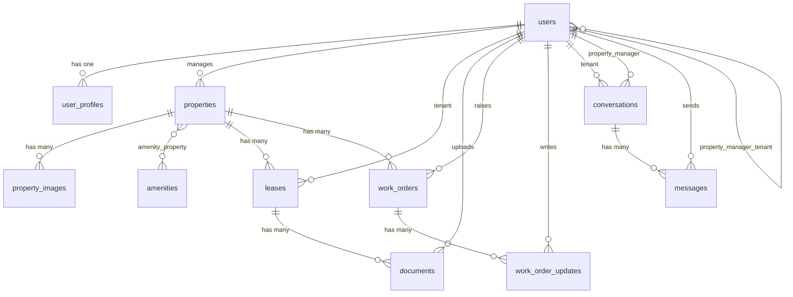

# Rently — Database Schema Documentation

> **Living document** — update this file as the project evolves.  
> Last updated: May 2026

---

## Table of Contents

1. [Overview](#overview)
2. [User Types](#user-types)
3. [ERD Diagram](#erd-diagram)
4. [Tables](#tables)
   - [users](#users)
   - [user_profiles](#user_profiles)
   - [roles (Spatie)](#roles-spatie)
   - [properties](#properties)
   - [property_images](#property_images)
   - [amenities](#amenities)
   - [amenity_property](#amenity_property)
   - [property_manager_tenant](#property_manager_tenant)
   - [leases](#leases)
   - [documents](#documents)
   - [work_orders](#work_orders)
   - [work_order_updates](#work_order_updates)
   - [conversations](#conversations)
   - [messages](#messages)
   - [notifications](#notifications)
   - [payments](#payments)
5. [Key Design Decisions](#key-design-decisions)

---

## Overview

Rently is a housing rental portal built in Laravel. It supports three user types — Tenant, Property Manager, and Administrator — each with their own dashboard and permissions.

**Tech stack**
- Laravel 13 + Breeze (auth scaffolding)
- Spatie Laravel Permission (roles)
- MySQL

---

## User Types

| Role | Description |
|------|-------------|
| `admin` | Full system access. Manages users, properties, and assignments. |
| `property_manager` | Manages their assigned properties and tenants. |
| `tenant` | Access to their own lease, documents, messages, and work orders. |

---

## ERD Diagram



---

## Tables

---

### users

> Scaffolded by Laravel Breeze. Extended with `first_name` and `last_name`.

| Column | Type | Notes |
|--------|------|-------|
| `id` | bigint, PK | |
| `first_name` | string | |
| `last_name` | string | |
| `email` | string, unique | |
| `email_verified_at` | timestamp, nullable | |
| `password` | string | Hashed |
| `remember_token` | string, nullable | |
| `created_at` | timestamp | |
| `updated_at` | timestamp | |

---

### user_profiles

> Extended profile data for all user types. Kept separate from `users` to keep the auth table lean.

| Column | Type | Notes |
|--------|------|-------|
| `id` | bigint, PK | |
| `user_id` | FK → users | Cascades on delete |
| `legal_name` | string | |
| `preferred_name` | string, nullable | |
| `phone` | string, nullable | |
| `address` | string, nullable | Personal home address |
| `emergency_contact_name` | string, nullable | |
| `emergency_contact_phone` | string, nullable | |
| `emergency_contact_relationship` | string, nullable | e.g. spouse, parent, friend |
| `profile_image` | text, nullable | Storage path or URL |
| `created_at` | timestamp | |
| `updated_at` | timestamp | |

---

### roles (Spatie)

> Managed by [Spatie Laravel Permission](https://spatie.be/docs/laravel-permission). Do not modify manually.

**Seeded roles:**

| Name |
|------|
| `admin` |
| `property_manager` |
| `tenant` |

**Related Spatie tables:** `permissions`, `model_has_roles`, `model_has_permissions`, `role_has_permissions`

---

### properties

> A property belongs to a property manager. Can be assigned to a tenant via a lease.

| Column | Type | Notes |
|--------|------|-------|
| `id` | bigint, PK | |
| `property_manager_id` | FK → users, nullable | Cascades on delete |
| `title` | string | |
| `slug` | string, unique | SEO-friendly URL identifier |
| `key_features` | text, nullable | Free text / WYSIWYG input |
| `description` | longtext | |
| `address` | string | |
| `latitude` | decimal(10,7), nullable | |
| `longitude` | decimal(10,7), nullable | |
| `price` | decimal(10,2) | Monthly rent |
| `property_type` | enum | `house`, `apartment`, `studio`, `commercial` |
| `bedrooms` | tinyint unsigned | |
| `bathrooms` | tinyint unsigned | |
| `size` | integer, nullable | Square footage/metres — unit defined at app level |
| `availability_status` | enum | `available`, `occupied`, `under_maintenance` |
| `created_at` | timestamp | |
| `updated_at` | timestamp | |

---

### property_images

> Stores images for a property. Supports featured image and ordering.

| Column | Type | Notes |
|--------|------|-------|
| `id` | bigint, PK | |
| `property_id` | FK → properties | Cascades on delete |
| `path` | text | Storage path or URL |
| `is_featured` | boolean | Default: false |
| `sort_order` | integer | Default: 0 |
| `created_at` | timestamp | |
| `updated_at` | timestamp | |

---

### amenities

> A seeded lookup table of available amenities.

| Column | Type | Notes |
|--------|------|-------|
| `id` | bigint, PK | |
| `name` | string | e.g. Parking, Garden |
| `slug` | string, unique | |
| `created_at` | timestamp | |
| `updated_at` | timestamp | |

---

### amenity_property

> Pivot table — many-to-many between properties and amenities.

| Column | Type | Notes |
|--------|------|-------|
| `property_id` | FK → properties | Cascades on delete |
| `amenity_id` | FK → amenities | Cascades on delete |

Composite primary key: `(property_id, amenity_id)`

---

### property_manager_tenant

> Pivot table — links a property manager to their assigned tenants. Managed by admin. Independent of leases so the assignment can exist before a lease is created.

| Column | Type | Notes |
|--------|------|-------|
| `property_manager_id` | FK → users | Cascades on delete |
| `tenant_id` | FK → users | Cascades on delete |
| `created_at` | timestamp | |
| `updated_at` | timestamp | |

Composite primary key: `(property_manager_id, tenant_id)`

---

### leases

> Links a tenant to a property for a defined period. Core record for tenancy management.

| Column | Type | Notes |
|--------|------|-------|
| `id` | bigint, PK | |
| `property_id` | FK → properties | Restrict on delete — preserves lease history |
| `tenant_id` | FK → users | |
| `status` | enum | `pending`, `active`, `ended`, `terminated` |
| `rent_amount` | decimal(10,2) | |
| `start_date` | date | |
| `end_date` | date, nullable | |
| `terminated_at` | timestamp, nullable | |
| `termination_notes` | text, nullable | |
| `created_at` | timestamp | |
| `updated_at` | timestamp | |

---

### documents

> Documents uploaded by a property manager for a tenant. Can optionally be tied to a lease. Supports simple signature flow.

| Column | Type | Notes |
|--------|------|-------|
| `id` | bigint, PK | |
| `uploaded_by` | FK → users | Cascades on delete |
| `tenant_id` | FK → users | Cascades on delete |
| `lease_id` | FK → leases, nullable | Null on delete — important docs linked to lease |
| `property_id` | FK → properties, nullable | Context anchor when no lease exists |
| `title` | string | |
| `path` | text | Storage path or URL |
| `document_type` | string | e.g. tenancy_agreement, epc, welcome_pack. Consider enum once types are finalised |
| `requires_signature` | boolean | Default: false |
| `is_signed` | boolean | Default: false |
| `signed_at` | timestamp, nullable | |
| `created_at` | timestamp | |
| `updated_at` | timestamp | |

> **Validation note:** At least one of `lease_id` or `property_id` should be present. Enforce at app/validation layer.

---

### work_orders

> Maintenance/repair requests. Can be raised by either a tenant or property manager.

| Column | Type | Notes |
|--------|------|-------|
| `id` | bigint, PK | |
| `property_id` | FK → properties | Restrict on delete — preserve history |
| `lease_id` | FK → leases, nullable | Null on delete |
| `raised_by` | FK → users | Cascades on delete |
| `assigned_to` | FK → users, nullable | Null on delete — property manager or contractor |
| `title` | string | |
| `description` | text | |
| `priority` | enum | `low`, `medium`, `high`, `urgent` |
| `status` | enum | `open`, `in_progress`, `pending_review`, `resolved`, `closed` |
| `resolved_at` | timestamp, nullable | |
| `created_at` | timestamp | |
| `updated_at` | timestamp | |

---

### work_order_updates

> Log of comments and updates on a work order. Each entry tracks who posted it.

| Column | Type | Notes |
|--------|------|-------|
| `id` | bigint, PK | |
| `work_order_id` | FK → work_orders | Cascades on delete |
| `user_id` | FK → users | Cascades on delete |
| `comment` | text | |
| `created_at` | timestamp | |
| `updated_at` | timestamp | |

---

### conversations

> One conversation thread per tenant/property manager relationship. Not tied to a specific property or lease.

| Column | Type | Notes |
|--------|------|-------|
| `id` | bigint, PK | |
| `tenant_id` | FK → users | Cascades on delete |
| `property_manager_id` | FK → users | Cascades on delete |
| `last_message_at` | timestamp, nullable | Used to sort inboxes by recent activity |
| `created_at` | timestamp | |
| `updated_at` | timestamp | |

---

### messages

> Individual messages within a conversation. Supports system-generated messages.

| Column | Type | Notes |
|--------|------|-------|
| `id` | bigint, PK | |
| `conversation_id` | FK → conversations | Cascades on delete |
| `sender_id` | FK → users | Cascades on delete |
| `body` | text | |
| `is_system_message` | boolean | Default: false. System messages cannot be replied to |
| `read_at` | timestamp, nullable | Null = unread |
| `created_at` | timestamp | |
| `updated_at` | timestamp | |

---

### notifications

> Managed by Laravel's built-in notification system. Generated via:
> ```bash
> php artisan notifications:table
> ```

| Column | Type | Notes |
|--------|------|-------|
| `id` | uuid, PK | |
| `type` | string | Notification class name |
| `notifiable_type` | string | Polymorphic — typically `App\Models\User` |
| `notifiable_id` | bigint | |
| `data` | text | JSON payload |
| `read_at` | timestamp, nullable | |
| `created_at` | timestamp | |
| `updated_at` | timestamp | |

---

### payments

> ⏳ **Deferred** — to be designed once core functionality is complete.

Planned links: `lease_id`, `tenant_id`, payment gateway reference, amount, status, due date.

---

## Key Design Decisions

| Decision | Reason |
|----------|--------|
| Single `users` table for all roles | Simpler auth flow. Roles managed by Spatie. |
| `property_manager_tenant` pivot independent of leases | Admin can assign a tenant to a manager before a lease exists. |
| `restrictOnDelete` on `property_id` in leases | Prevents accidental deletion of a property with active/historical leases. |
| `tenant_id` uses `constrained('users')` explicitly | Laravel cannot infer the `users` table from a non-standard column name. |
| `last_message_at` on conversations | Avoids expensive subqueries when sorting inboxes. |
| `is_system_message` on messages | Allows UI to style and disable replies on automated messages (e.g. work order updates). |
| `read_at` timestamp instead of boolean | Gives read time for free, not just read state. |
| `document_type` as string (not enum yet) | Types not fully defined yet — convert to enum once finalised. |
| Laravel built-in notifications table | Integrates with `Notifiable` trait, supports multiple channels out of the box. |
| Spatie Laravel Permission for roles | Battle-tested, widely supported, clean API (`assignRole`, `hasRole`). |
