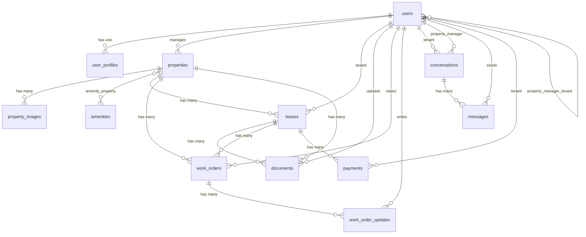

# Rently — Database Schema

> Database tables, columns, types and relationships.
> Last updated: May 2026

---

## Table of Contents

1. [ERD Diagram](#erd-diagram)
2. [Tables](#tables)
3. [Key Design Decisions](#key-design-decisions)

---

## ERD Diagram

---

## Tables

---

### users

> Scaffolded by Laravel Breeze. Extended with `first_name` and `last_name`.

| Column | Type | Notes |
|--------|------|-------|
| `id` | bigint, PK | |
| `first_name` | string | |
| `last_name` | string | |
| `email` | string, unique | |
| `email_verified_at` | timestamp, nullable | |
| `password` | string | Hashed |
| `remember_token` | string, nullable | |
| `created_at` | timestamp | |
| `updated_at` | timestamp | |

Cashier adds: `stripe_id`, `pm_type`, `pm_last_four`, `trial_ends_at`.

---

### user_profiles

| Column | Type | Notes |
|--------|------|-------|
| `id` | bigint, PK | |
| `user_id` | FK → users | Cascades on delete |
| `legal_name` | string | |
| `preferred_name` | string, nullable | |
| `phone` | string, nullable | |
| `address` | string, nullable | Personal home address |
| `emergency_contact_name` | string, nullable | |
| `emergency_contact_phone` | string, nullable | |
| `emergency_contact_relationship` | string, nullable | |
| `profile_image` | text, nullable | Public storage path |
| `created_at` | timestamp | |
| `updated_at` | timestamp | |

---

### roles (Spatie)

Seeded roles: `admin`, `property_manager`, `tenant`

Related tables: `permissions`, `model_has_roles`, `model_has_permissions`, `role_has_permissions`

---

### properties

| Column | Type | Notes |
|--------|------|-------|
| `id` | bigint, PK | |
| `property_manager_id` | FK → users, nullable | Cascades on delete |
| `title` | string | |
| `slug` | string, unique | |
| `key_features` | text, nullable | |
| `description` | longtext | |
| `address` | string | |
| `latitude` | decimal(10,7), nullable | |
| `longitude` | decimal(10,7), nullable | |
| `price` | decimal(10,2) | Monthly rent |
| `property_type` | enum | `house`, `apartment`, `studio`, `commercial` |
| `bedrooms` | tinyint unsigned | |
| `bathrooms` | tinyint unsigned | |
| `size` | integer, nullable | |
| `availability_status` | enum | `available`, `occupied`, `under_maintenance` |
| `created_at` | timestamp | |
| `updated_at` | timestamp | |

---

### property_images

| Column | Type | Notes |
|--------|------|-------|
| `id` | bigint, PK | |
| `property_id` | FK → properties | Cascades on delete |
| `path` | text | Public storage path — always use `Storage::url($path)` |
| `is_featured` | boolean | Default: false |
| `sort_order` | integer | Default: 0 |
| `created_at` | timestamp | |
| `updated_at` | timestamp | |

---

### amenities

| Column | Type | Notes |
|--------|------|-------|
| `id` | bigint, PK | |
| `name` | string | |
| `slug` | string, unique | |
| `created_at` | timestamp | |
| `updated_at` | timestamp | |

---

### amenity_property

Pivot — many-to-many between properties and amenities.

| Column | Type |
|--------|------|
| `property_id` | FK → properties, cascades |
| `amenity_id` | FK → amenities, cascades |

Composite PK: `(property_id, amenity_id)`

---

### property_manager_tenant

Pivot — links property managers to their assigned tenants.

| Column | Type |
|--------|------|
| `property_manager_id` | FK → users, cascades |
| `tenant_id` | FK → users, cascades |
| `created_at` | timestamp |
| `updated_at` | timestamp |

Composite PK: `(property_manager_id, tenant_id)`

---

### leases

| Column | Type | Notes |
|--------|------|-------|
| `id` | bigint, PK | |
| `property_id` | FK → properties | Restrict on delete |
| `tenant_id` | FK → users | |
| `status` | enum | `pending`, `active`, `ended`, `terminated` |
| `rent_amount` | decimal(10,2) | |
| `start_date` | date | |
| `end_date` | date, nullable | Null = open-ended |
| `terminated_at` | timestamp, nullable | |
| `termination_notes` | text, nullable | |
| `created_at` | timestamp | |
| `updated_at` | timestamp | |

---

### documents

| Column | Type | Notes |
|--------|------|-------|
| `id` | bigint, PK | |
| `uploaded_by` | FK → users | Cascades on delete |
| `tenant_id` | FK → users | Cascades on delete |
| `lease_id` | FK → leases, nullable | Null on delete |
| `property_id` | FK → properties, nullable | |
| `title` | string | |
| `path` | text | Private storage path |
| `document_type` | string | tenancy_agreement, epc, welcome_pack, etc |
| `requires_signature` | boolean | Default: false |
| `is_signed` | boolean | Default: false |
| `signed_at` | timestamp, nullable | |
| `created_at` | timestamp | |
| `updated_at` | timestamp | |

---

### work_orders

| Column | Type | Notes |
|--------|------|-------|
| `id` | bigint, PK | |
| `property_id` | FK → properties | Restrict on delete |
| `lease_id` | FK → leases, nullable | Null on delete |
| `raised_by` | FK → users | Cascades on delete |
| `assigned_to` | FK → users, nullable | Null on delete |
| `title` | string | |
| `description` | text | |
| `priority` | enum | `low`, `medium`, `high`, `urgent` |
| `status` | enum | `open`, `in_progress`, `pending_review`, `resolved`, `closed` |
| `resolved_at` | timestamp, nullable | |
| `created_at` | timestamp | |
| `updated_at` | timestamp | |

---

### work_order_updates

| Column | Type | Notes |
|--------|------|-------|
| `id` | bigint, PK | |
| `work_order_id` | FK → work_orders | Cascades on delete |
| `user_id` | FK → users | Cascades on delete |
| `comment` | text | |
| `created_at` | timestamp | |
| `updated_at` | timestamp | |

---

### conversations

| Column | Type | Notes |
|--------|------|-------|
| `id` | bigint, PK | |
| `tenant_id` | FK → users | Cascades on delete |
| `property_manager_id` | FK → users | Cascades on delete |
| `last_message_at` | timestamp, nullable | Cast to datetime |
| `created_at` | timestamp | |
| `updated_at` | timestamp | |

---

### messages

| Column | Type | Notes |
|--------|------|-------|
| `id` | bigint, PK | |
| `conversation_id` | FK → conversations | Cascades on delete |
| `sender_id` | FK → users | Cascades on delete |
| `body` | text | |
| `is_system_message` | boolean | Default: false |
| `read_at` | timestamp, nullable | Cast to datetime. Null = unread |
| `created_at` | timestamp | |
| `updated_at` | timestamp | |

---

### payments

| Column | Type | Notes |
|--------|------|-------|
| `id` | bigint, PK | |
| `lease_id` | FK → leases | Restrict on delete |
| `tenant_id` | FK → users | Cascades on delete |
| `stripe_payment_intent_id` | string, nullable | Checkout session ID initially, replaced with payment intent ID on success |
| `amount` | decimal(10,2) | |
| `currency` | string | Default: `gbp` |
| `status` | enum | `pending`, `paid`, `failed`, `refunded` |
| `payment_method` | enum | `stripe`, `manual` |
| `due_date` | timestamp, nullable | Cast to datetime |
| `paid_at` | timestamp, nullable | Cast to datetime |
| `notes` | text, nullable | |
| `created_at` | timestamp | |
| `updated_at` | timestamp | |

---

### notifications

> Laravel built-in. Generated via `php artisan notifications:table`.

| Column | Type | Notes |
|--------|------|-------|
| `id` | uuid, PK | |
| `type` | string | Notification class name |
| `notifiable_type` | string | Polymorphic |
| `notifiable_id` | bigint | |
| `data` | text | JSON payload |
| `read_at` | timestamp, nullable | |
| `created_at` | timestamp | |
| `updated_at` | timestamp | |

---

### Cashier tables

Generated by `php artisan vendor:publish --tag="cashier-migrations"`:
- `subscriptions`
- `subscription_items`

---

## Key Design Decisions

| Decision | Reason |
|----------|--------|
| Single `users` table for all roles | Simpler auth. Roles managed by Spatie. |
| `user_profiles` separate | Keeps auth table lean. |
| `property_manager_tenant` independent of leases | Assignment can exist before a lease. |
| `restrictOnDelete` on `property_id` in leases | Preserves lease history. |
| `tenant_id` uses explicit `constrained('users')` | Laravel can't infer `users` from non-standard column name. |
| `last_message_at` on conversations | Avoids expensive subqueries when sorting inboxes. |
| `is_system_message` on messages | UI can disable replies on automated messages. |
| `read_at` timestamp not boolean | Gives read time for free. |
| `document_type` as string | Types not finalised — convert to enum once confirmed. |
| `stripe_payment_intent_id` stores session ID initially | Replaced with real payment intent ID on webhook/success. |
